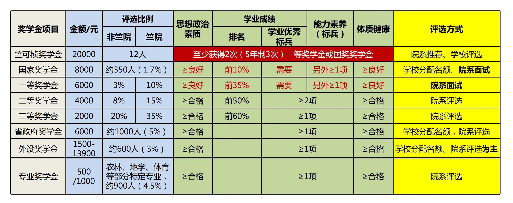

# 奖学金

本科生奖学金是浙江大学面向全日制本科生个人进行的表彰（极少数奖学金面向集体），既是荣誉表彰，也有奖金奖励。校级及以上的所有奖学金，除特殊说明外，一般荣誉兼得，奖金就高（即只发放所获各项奖学金中奖金金额最高的一项），评选时间一般为9-10月，通常以年级/专业为单位进行评选。

## 政府奖学金

### 国家奖学金

- 授奖单位：中华人民共和国教育部等

- 奖金金额：8000元/人

- 评选比例：名额一般由学校下拨，比例大约为1.7%，获奖者同时直接授予浙江大学一等奖学金，不占一奖名额

- 基础条件：获得优秀学生荣誉称号，且学业综合成绩在10%以前

- 评选方式：一般通过面试或答辩进行评选

### 浙江省政府奖学金

- 授奖单位：浙江省教育厅等

- 奖金金额：6000元/人

- 评选比例：名额一般由学校下拨，比例大约为5%

- 基础条件：思想政治素质等级良好及以上，体质健康等级合格及以上

- 评选方式：评选单位自行确定

## 校设奖学金

### 竺可桢奖学金

- 授奖单位：浙江大学

- 奖金金额：20000元/人

- 评选比例：竺可桢奖学金为校设最高奖学金，每年全校范围评选本科生12人，研究生12人，各院系可推荐本科生1人，研究生1人，竺可桢学院可推荐3人

- 基础条件：至少获得2次国家奖学金或浙江大学一等奖学金（五年制3次）

- 评选方式：院系推荐-文本评审-公开答辩

### 浙江大学奖学金

- 授奖单位：浙江大学

- 奖金金额：一等6000元/人，二等4000元/人，三等2000元/人

- 评选比例：一等5%，二等8%，三等20%（竺院及荣誉项目班一等10%，二等15%，三等35%），一等奖学金比例不包括获国家奖学金学生

- 基础条件：

    - 一等：学业综合成绩前35%，且获得优秀学生荣誉

    - 二等：学业综合成绩前50%，且获得两项及以上标兵荣誉

    - 三等：学业综合成绩前60%，且获得一项及以上标兵荣誉

- 评选方式：院系自行确定，原则上一等奖学金需要面试

### 专业奖学金

仅面向农林、地学、体育等部分特定专业，奖金金额为500或1000元，要求至少获得1项标兵荣誉称号，由对应院系自行评选。

## 外设奖学金

外设奖学金是浙江大学校友、社会企业或爱心人士捐资设立的奖学金。

- 授奖单位：对应捐资单位或个人，由浙江大学代章，视为校级奖学金

- 奖金金额：1500-13900元不等

- 评选比例：具体奖学金项目及名额由学校下拨，总体比例约为3%

- 基础条件：获得一项及以上标兵荣誉称号，且符合对应外设奖学金评选的特殊要求

- 评选方式：院系自行确定

## 院设奖学金

院设奖学金是浙江大学各院系设立的，仅面向本学院学生的奖学金，奖学金项目、名额、奖金金额、评选时间、评选要求及方式等均由学院与设奖单位根据协议确定。通常院设奖学金与其他校级及以上奖学金荣誉兼得、奖金兼得。

## 港澳台及华侨奖学金

### 港澳及华侨学生奖学金

- 授奖单位：中华人民共和国教育部等

- 面向对象：香港籍学生、澳门籍学生、华侨学生

- 奖金金额及比例（2023年）

    - 特等奖：1人，8000元

    - 一等奖：3人，6000元

    - 二等奖：5人，5000元

    - 三等奖：9人，4000元

- 评选方式：学生自主申请，学校统一文本评审

### 台湾学生奖学金

- 授奖单位：中华人民共和国教育部等

- 面向对象：台湾学生

- 奖金金额及比例（2023年）

    - 一等奖：2人，6000元

    - 二等奖：3人，5000元

    - 三等奖：4人，4000元

- 评选方式：学生自主申请，学校统一文本评审
