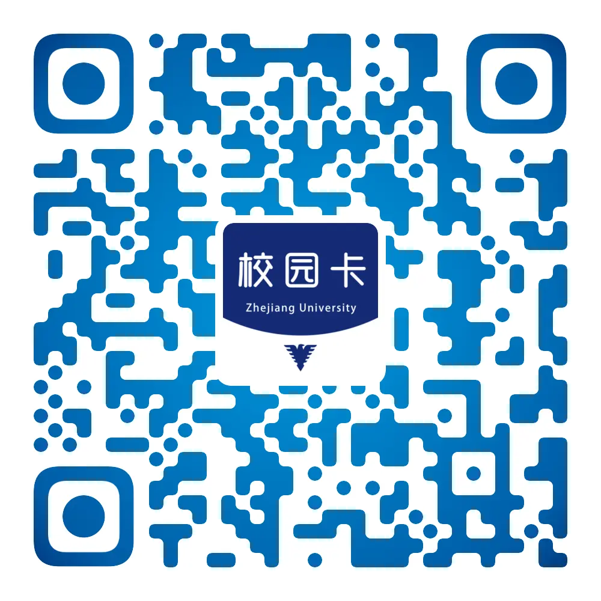

# 软件与APP

## 官方

### 浙江大学统一身份认证

浙江大学统一身份认证是所有浙大人在浙大网络系统中的通行证，几乎所有浙江大学的网络应用都需要用到。首次使用时需要绑定手机号激活，具体流程请参照随通知书发放的《入学须知》或本指引首页[从0开始激活通行证](../network_detailed.md)。

通过统一身份认证可以访问大量个人资源，因此保持账号密码安全十分重要。通过访问[个人服务中心](https://zjuam.zju.edu.cn/zjuam-main/)，可修改个人信息、修改重置密码、设置别名。需要注意的是，**修改手机号码会导致浙大钉删除浙江大学组织下原来手机号码绑定的所有账号信息，并自动退出所有关联的群，请谨慎修改！**

### 浙大钉 / 钉钉

浙大钉是浙江大学校内信息沟通的主要平台，提供了课程群聊、消息通知以及大量工作台应用。初次使用浙大钉需要首先注册登录并加入浙江大学组织，具体流程请参照随通知书发放的《入学须知》或本指引首页[从0开始激活通行证](../network_detailed.md/#_4)。浙大钉实质上是浙大特供版本的钉钉，**使用普通版本的钉钉并在工作台切换至浙江大学，也可以实现同样的功能**。

**请不要退出浙江大学组织**，这会使所有浙江大学群聊不可用，后续恢复较为麻烦，需要联系信息技术中心(电话:0571-87951669)。

更多使用指南可参考信息技术中心[指南](https://itc.zju.edu.cn/2020/0210/c45425a1959363/page.htm)。

### 浙大体艺

浙大体艺，是浙江大学公共体育与艺术部的官方APP，主要提供了以下功能

- 体育课考勤
- 身体素质课考勤
- 体测预约与成绩查询
- 比赛报名与管理
- 运动场馆服务
- 团课报名
- 其他功能

下载方式

- 苹果系统：APP STORE搜索“浙大体艺”下载或扫描下方二维码下载
- 安卓系统：应用宝搜索“浙大体艺”下载或扫描下方二维码下载

  

### 浙大校园卡APP

浙大校园卡APP提供了校园卡二维码付款、校园卡充值、账单管理等功能。更多使用技巧可参考浙江大学校园卡管理办公室发布的[应用指南](https://ecard.zju.edu.cn/plat-pc/newsannouncement/detail/381)

下载二维码:

## 第三方

使用第三方App可能会导致**个人信息泄露、数据更新不及时**等问题，请在考虑可能的**风险与后果**后**谨慎选用**第三方APP。

### Celechron：服务于浙大学生的时间管理器

[Celechron](https://www.cc98.org/topic/5807824)由CC98论坛用户[@iotang](https://www.cc98.org/user/id/672329)开发，安装指南详见[其文档与安装指南](https://www.cc98.org/topic/5807824)。

Celechron 是一个为浙大学生服务的开源时间管理器，Celechron 提供日程、课表、课程、成绩的查询功能和自动规划任务功能。

### 求是潮Mobile

[Mobile](https://www.qsc.zju.edu.cn/mobile)是浙江大学求是潮开发的校园内一站式app，可以方便地在手机上查看课表，查询成绩等。
