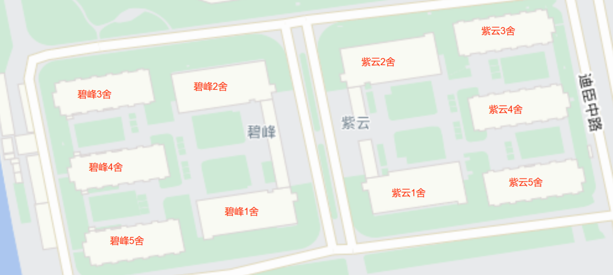

# 云峰学园

## 简介

浙江大学求是学院紫云碧峰学园简称“云峰学园”。

## 专业结构

云峰学园的大类方向涉及艺术与科技、书法学、工科试验班（信息）、工科试验班（材料、化工、高分子）、应用生物科学（生工食品）、应用生物科学（农学）等领域；主要对应艺术与考古学院、材料科学与工程学院、电气工程学院、化学工程与生物工程学院、高分子科学与工程学院、光电科学与工程学院、信息与电子工程学院、控制科学与工程学院、计算机科学与技术学院、生物医学工程与仪器科学学院、生物系统工程与食品科学学院、环境与资源学院、农业与生物技术学院、动物科学学院等14个院系。

## 学园办公地点

| 地点       | 碧峰连廊127  | 碧峰连廊126 |  碧峰连廊128    | 碧峰连廊129、130  | 紫云4舍学生成长服务站 |
| --------- | ------------ | ----------- | ------------- | -----------------| ----------------------|
| **职务**   | 学园主任    | 学园副主任    | 分团委书记     | 大部分辅导员      | 事务专员               |

## 园区空间及功能

### 云峰学生成长服务站

浙江大学求是学院为推进“最多跑一次”改革向社区延伸，着力打造“学生成长服务站”，常态化提供党建团建、学生事务、园区公共事务等咨询服务，精准对接学生实际需求，满足社区学生多元化、个性化的思想学习生活需求。

求是学院云峰学园学生成长服务站目前服务事项有：

- 公共空间类：求是学院云峰学园公共空间预约借用管理；

- 活动物资类：云峰学园活动物资的借用和管理；

- 党团建设类：优秀团员、优秀团干部、先进团支部、入党积极分子结业证书等证书领取及其他党团建设事务办理；

- 学生事务类：新生手册等各类材料的收发、新生学生证等办理，及其他学生日常事务办理；

办公地点：紫云四舍006党员之家西侧

办公时间：周一至周日8:30-22:30

办公电话：（0571）88982241

### 毕至居

云峰学园目前有3个毕至居，分别位于，紫1原车库、紫4架空层和碧4架空层。

紫1毕至居又名星辰毕至居，2023年新建，可容纳25人，烹饪设备齐全，此外还有钢琴、电子屏等。

借用方式：周一至周五，前往紫云4舍学生成长服务站线下借用；周末在浙大学生公寓管理服务中心公众号里借用。
> 紫一毕至居优先归云峰学园内部使用，工作日期间借用若与学园活动冲突，需优先保证云峰学园活动的进行。

紫4和碧4毕至居每天均可通过学生公寓公众号借用，可容纳10人。

### 洗衣房

云峰学园有2个洗衣房，分别位于紫云2舍和紫云大门走廊交界处、碧峰2舍和碧峰大门走廊交界处，24h开放，每个洗衣房有9台洗衣机和3台烘干机；有偿使用。

### 健身房

云峰学园健身房位于碧峰4舍架空层（朝向碧峰5舍），开放时间为8:30-22:30，免费面向全体师生开放。

### 水墨云峰咖啡吧

水墨云峰咖啡吧位于碧峰4舍（电子屏后），是有声自习空间，开放时间为10:00-22:30，其中在10:00-19:00，作为麦斯威餐厅，可购买饮品等，19:00以后由学生组织协助管理，作为自习空间。

水墨云峰咖啡吧也是师生交流咖啡吧，可供老师和学生交流。如需开展班级活动、寝室活动等，同样可以预约借用，借用方式：请指导老师前往紫云4舍学生成长服务站线下登记借用。

### 活动室、自习室和宣传场地等其它公共空间

宣传场地位于紫云和碧峰中间的广场（未来广场），分A-J区；自习室和活动室在紫云4舍架空层、碧峰4舍架空层、紫云连廊等均有分布；详情请见下表：

### 宿舍总值班室

宿舍管理人员分别在紫云和碧峰大门各设有一个总值班室，内有微波炉等设备，总值班室是处理寝室相关问题最近、最直接的地方，可处理的事情包括但不限于：自行车胎打气、缝补衣物、更换饮水机、借用寝室钥匙、借用五金工具等。

此外，每幢寝室楼下的门厅均设有宿管的值班台，如遇寝室相关问题，可前往楼下值班台或者学园大门的总值班室请求解决。

## 特色活动

云峰学园举办过并且仍可能举办的特色活动有：

- 棉花糖音乐节：每年一次的大型音乐节活动；
- 启真峰云篮球赛：即篮球赛，有3人赛和5人赛，还有1v1单挑趣味赛；
- 云语分享会系列活动：邀请优秀学长学姐做相关主题经验分享；
- 寝室嘉年华系列活动：按季节举办，以促进寝室友谊、促进与新生之友交流的趣味运动的形式；
- 耕读农创系列活动：以耕作、栽培相关植物为主体的活动，形式多样；
- 朋辈辅学：邀请某些课程成绩优异的同学给学习暂时落后的同学在课外时间给予辅导，活动有一定经费支持，被辅导的同学是完全免费参与。一般每年3月和10月为报名时间，开设的课程有：微积分、C程、有机化学、大学物理等多门公共基础课；
- “书情”活动：以写信为主要形式，有免费的信纸、信封和明信片，工作人员还会将信件免费帮助寄送到指定的收件人处；
- 云峰十佳歌手：分海选-复赛-决赛三个阶段，面向全校开放报名，可组队参赛；
- 寝室游园会：军训后到正式开学前举办，以促进寝室良好关系和寝室与新生之友交流为主要活动目的；
- 樱花季系列活动：每年3月份前后为云峰学园樱花盛开的时期，此时期将会举办各种以樱花为主题的活动，包括但不限于摄影、写诗等活动形式；
- “相约星期五”系列讲座：邀请各院系相关老师来做党建相关的专题讲座，并与同学交流心得体会；
- “经典研读社”系列活动：由求是学院紫云碧峰学园、浙江大学马一浮书院主办，以每期确定某一经典著作，邀请同学阅读之后前来与老师交流心得感悟为主要活动形式；
- 卓越论坛系列活动：每一期邀请院系有显著成果的老师前来做专业知识、专业前沿相关的专题讲座；
- “菁英计划”：以培养优秀的入党积极分子为目标，举办各系列党建活动，提高参与者的政治素养等。

## 官方网站和公众号

[云峰学园官方网站](https://yunfeng.zju.edu.cn)

微信公众号：

