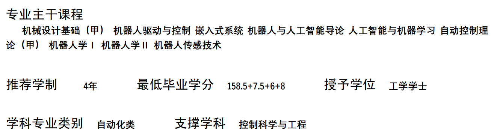

# 培养方案

培养方案涵盖了相关专业的培养目标、毕业要求、毕业学分、学制、学位、主干课程、修读课程等众多重要信息，是学生专业分流时进行选择的重要参考，也是相关专业学生选课的重要依据。

培养方案在开学初会以PDF文件形式发送给学生， 学生亦可在浙大钉APP、浙江大学现代教务管理系统、[浙江大学本科生院办公网](https://bksy.zju.edu.cn/28309/list.htm)等网站上自行搜索查阅。目前，浙大钉APP及教务系统已更新2023级培养方案，下文示例参考2022级机器人工程专业培养方案。

> 竺可桢学院中混合班、人文社科实验班、医学实验班（八年制）也就是巴德年班的培养方案为个性化培养方案，由于实际实施中是一人一策，这里不展开介绍，相关同学可向竺可桢学院教学科或学长组了解。

## 目标与要求

浙江大学对于每一专业均会制定相应的培养目标和毕业要求，如后页图所示。该目标和要求是学生学习成长的参考，但并非硬性指标。
  
## 主干课程、毕业学分、学制学位

### 专业主干课程

专业主干课程是该专业最核心、最重要、最关键，但也往往是内容最多、难度最大的课程，同时也是每一位选择该专业的学生必须掌握的课程。

### 推荐学制

即在正常情况下（不提前亦不延期毕业），该本科专业应当修读的年限。绝大部分专业为4年，医学院部分专业、建筑学和动物医学专业为5年。本科阶段学制最多可延长2年。

### 最低毕业学分（参考上图）

即在满足各项课程修读要求前提下，毕业需要修读的最低学分数。其中：

- 158.5学分：除部分特殊课程外，正常理论和实践课程需要修读的学分；
- +7.5学分：部分特殊课程，达到一定标准后可获得**认定学分**，包括形势与政策I（+1）、形势与政策II（+1）、军训（+2）、体测与锻炼（+0.5）、美育类（+1）、劳育类（+1）和英语水平测试（+1），该类课程在“课程设置与学分分布”中，学分含“+”号；
- +6学分：跨专业模块（+3）与国际化模块（+3）学分；
- +8学分：第二课堂（+4）、第三课堂（+2）和第四课堂（+2）学分，可通过参加相关活动进行申请和认定，见[四课融通](./concepts.md/#_5)。

### 授予学位

本科毕业授予的学位均为“学士”，依据学科不同，分为：哲学、经济学、法学、教育学、文学、历史学、理学、工学、农学、医学、管理学、艺术学、建筑学。

### 学科专业类别与支撑学科

该专业所属的学科类别和对应的一级学科。

## 课程设置与学分分布

### 课程类别

依据课程内容不同，可划分为通识课程、专业基础课程、专业课程、个性课程、跨专业模块、国际化模块和第二、三、四课堂等。依据课程修读要求不同，可分为必修课程和选修课程，在培养方案中设置若干级标题进行分类，每级标题右侧都有该标题下涵盖课程的学分修读要求。

### 课程信息

1. 课程号：即课程的代码，是该门课程的“身份标记”；
部分课程可能中途遇上课程改革，课程号有变更，在选课系统（见“第五篇：选课系统”）中课程名称一致，但课程号不同，请小心注意。
2. 课程名称：无需解释；
3. 学分：前文已述，带“+”号为+7.5 +6 +8中相关的课程；
4. 周学时：即“课时”，其中4.0-2.0表示每周理论课课时为4课时，实践课课时为2课时；
5. 建议学年学期：即建议该专业学生在某学年某学期修读该课程，最好按照培养方案中建议学年学期来进行课程的修读，否则可能出现较多问题，如部分专业课需要预先修读其他课程，未修读可能导致课程进展困难。

### 通识类课程

通识类课程通常分为三大块：第一类为几乎所有大学生均必须修读的固定课程，如思政类、军体类、外语类；第二类为该专业涉及的底层基础学科课程，如计算机类、自然科学通识类；第三类为学生需要自主选择修读的非专业性课程，如美育类、劳育类、创新创业类和通识选修课。

大部分通识课程将在大一学年修读完成，少部分留待大二、大三学年修读。

### 思政类课程

除港澳台生和留学生外，其余学生必须修读思政类课程，港澳台生及留学生需要用其他课程来置换该部分学分。思政类课程往往会直接预置（见“第五篇：选课系统”），包括：

1. 形势与政策I、II（形策）；
2. 思想道德与法治（思修）；
3. 中国近现代史纲要（史纲）；
4. 马克思主义基本原理（马原）；
5. 毛泽东思想与中国特色社会主义理论体系概论（毛概）；
6. 习近平新时代中国特色社会主义思想概论（习概）；
7. 四史系列课程：包括中国改革开放史、新中国史、中国共产党历史、社会主义发展史，四选一修读。

### 军体类课程

包括军事类和体育类课程：

1. 军训：见[军训](../military_training/time.md) ；
2. 军事理论：与军事相关的理论知识教育和国防安全教育，通常会预置；
3. 体育课：2023级学生须修读6学期体育课（体育I~体育VI），自主选课；
4. 体测与锻炼：各学年体质健康测试达标后可获得学分；

### 美育类、劳育类课程

对学生审美与劳动能力的训练，按照培养方案正常修读即可。美育、劳育类课程均为认定型课程，即：若修读的某一门课程满足美育或劳育的课程要求，则除获得该课程原本的学分以外，自动认定获得美育或劳育课程的1学分（该1学分不计绩点，原课程学分计绩点）。

### 外语类

#### 外语课程

所有课程号带有“F”的课程均为外语类课程，学生可自主选择修读，完成6学分即可。大一新生将预置大学英语III或大学英语IV（简称大英三或大英四）。修读完大英三后可继续修读大英四，但修读完大英四后修读大英三不计学分，须选择其他F类课程修读。

> F类课程往往抢课困难，请谨慎退课。此外，涉及校区搬迁，尤其是需要搬迁至舟山校区的海洋学院学生，建议在大一、大二两学年内修满外语学分，否则跨校区修读极为不便。

#### 英语水平测试

简称“水测”。学生从大二学年开始可申请“英语水平测试”（高三学年修读外语为小语种的学生可申请小语种水平测试），测试包括听力、阅读、写作、口语等模块，达标后可获得1学分认定学分（两级制，不计绩点）；也可通过六级成绩、托福、雅思成绩等申请水测免测获得该认定学分。

### 计算机类

与计算机及编程相关的课程，如C语言程序设计（简称C小程）、程序设计专题（简称C大程）等，几乎每个专业都会有，但课程类别与要求不同。

2023级开始，C小程C大程合为一门4学分课程：C程序设计基础和实验。

同时新增“人工智能基础（A）”与“人工智能基础（B）”，A主要面向理工农医（非信息专业）学生开设，B则面向人文社科专业学生开设，讲解人工智能模型算法及其在不同学科中的运用。

### 自然科学通识类

基础的自然科学学科课程，即“数理化生”等基础课及其配套实验课，如微积分、大学物理、有机化学等，各专业要求不同，但对大多数学生均十分重要，内容多、难度大。部分课程分若干学期开课，课程名称将按I、II、III进行标号。部分课程设置不同难度梯度，甲＞乙＞丙。

### 创新创业类

与创新创业和学生职业生涯规划引导相关的课程，按照培养方案要求进行修读即可。

> 职业生涯规划课程往往比较难选上。

### 通识选修课程

学生可自主选择修读，要求至少修读10.5学分，且溢出学分中最多2学分可作为个性课程学分（见后文）。
关于上图中“1）”的表述，通识核心课程课程号含有“S”。关于上图中“3）”的表述，指修读“两门”而非“两类各一门”，因此学生可在规定的同一类别中（如中华传统）选择两门课程修读。

### 专业基础课

专业基础课程是与该专业领域相关的重要课程，通常含有部分专业主干课程。相较于自然科学通识类课程，专业基础课程与专业联系更加紧密，已经接触到涉及学科本身的基础知识。但与专业课程相比，专业基础课涉及面较广，是各具体专业方向的基础。

### 专业课程

专业课程通常分为专业必修课、专业选修课和毕业论文（设计），此外，部分专业根据细分方向的不同，会将同一方向的一批课程整合成为一个模块，称为“专业模块课程”，部分专业由于实践的需要，将开设实践教学课程。

实践教学环节一般开设在短学期（夏学期以后）。在选课时，短学期课程在其之前的夏学期进行选课，而学分和绩点计入其后的秋冬学期。

### 个性修读课程

个性修读课程的学分亦可称为“溢出学分”。简言之：若学生恰好按照培养方案，一分不差地完成除个性课程外其他课程的修读，则还需自主选课，多修读课程作为“溢出学分”，即“个性学分”。个性修读课程要求（如学分、具体课程要求）因学院而不同，请查询自己专业的培养方案，但都至少要求修读一门不在本专业培养方案中的课程。

其中，“通识选修类课程”最多只能溢出2学分作为个性学分。若本人专业课（如专业选修课）存在学分溢出的情况，亦可作为个性学分，且“溢出”学分是可以拆分的。如：一门5学分专业选修课，若有溢出，可将2学分作为专业选修课学分，3学分作为个性学分。

### 跨专业与国际化

> 在2023级培养方案中，这两个模块已经不在培养方案中体现，对跨专业课程的要求移入个性修读课程中，要求在个性修读课程中至少有一门跨专业课程，而国际化模块的要求在培养方案中不再体现。

设置这两个模块的目的在于培养学生跨专业能力、学科交叉能力和国际化视野，按照培养方案要求进行选课和修读即可。学生修读的课程同时满足跨专业/国际化要求和其他模块（如自然科学通识类）要求的，可同时认定学分。

## 辅修

培养方案中含有“辅修培养方案”的专业将开设辅修课程，若无则代表该专业不开设辅修课。按照辅修深入程度的不同，可分为微辅修、辅修专业、辅修学位三类，完成辅修后可获得对应辅修证书。
