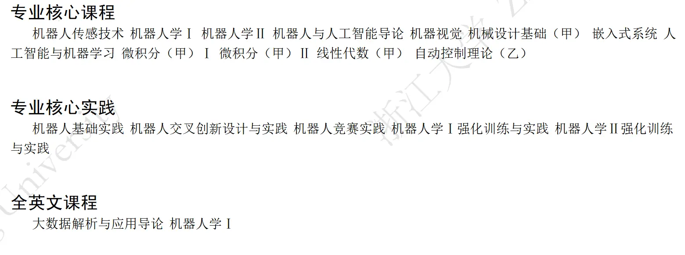

# 培养方案

培养方案涵盖了相关专业的培养目标、毕业要求、毕业学分、学制、学位、主干课程、修读课程等众多重要信息，是学生专业分流时进行选择的重要参考，也是相关专业学生选课的重要依据。

培养方案在开学初会以PDF文件形式发送给学生， 学生亦可在浙大钉APP、浙江大学现代教务管理系统、[浙江大学本科生院办公网](https://zjuers.com/rd?url=https://bksy.zju.edu.cn/28309/list.htm&mode=1)等网站上自行搜索查阅。目前，浙大钉APP及教务系统已更新2023级培养方案，下文示例参考2024级机器人工程专业培养方案。

> 竺可桢学院中混合班、人文社科实验班、医学实验班（八年制）也就是巴德年班的培养方案为个性化培养方案，由于实际实施中是一人一策，这里不展开介绍，相关同学可向竺可桢学院教学科或学长组了解。

## 导引信息

### 目标与要求

浙江大学对于每一专业均会制定相应的培养目标和毕业要求，如后页图所示。该目标和要求是学生学习成长的参考，但并非硬性指标。

  
### 主干课程、毕业学分、学制学位

### 专业核心课程

专业主干课程是该专业最核心、最重要、最关键，但也往往是内容最多、难度最大的课程，同时也是每一位选择该专业的学生必须掌握的课程。

### 专业核心实践

专业核心实践同专业主干课程类似，不过主要以实践为主。

### 全英文课程

课如其名，是全英文讲解的课程。

### 推荐学制

即在正常情况下（不提前亦不延期毕业），该本科专业应当修读的年限。绝大部分专业为4年，医学院部分专业、建筑学和动物医学专业为5年。本科阶段学制最多可延长2年。

### 最低毕业学分（参考上图）

即在满足各项课程修读要求前提下，毕业需要修读的最低学分数。其中：

- 158学分：第一课堂所有课程，包括正常理论和实践课程等需要修读的学分；
- +8学分：第二课堂（+4）、第三课堂（+2）和第四课堂（+2）学分，可通过参加相关活动进行申请和认定，见[四课融通](./concepts.md/#_5)。

### 授予学位

本科毕业授予的学位均为“学士”，依据学科不同，分为：哲学、经济学、法学、教育学、文学、历史学、理学、工学、农学、医学、管理学、艺术学、建筑学。

### 学科专业类别与支撑学科

该专业所属的学科类别和对应的一级学科。

## 课程设置与学分分布

### 课程类别

依据课程内容不同，可划分为通识类课程、专业基础课、专业课程、个性修读课程、其他必修环节和第二、三、四课堂等。依据课程修读要求不同，可分为必修课程和选修课程，在培养方案中设置若干级标题进行分类，每级标题右侧都有该标题下涵盖课程的学分修读要求。

### 课程信息

1. 课程号：即课程的代码，是该门课程的“身份标记”；
部分课程可能中途遇上课程改革，课程号有变更，在选课系统（见“第五篇：选课系统”）中课程名称一致，但课程号不同，请小心注意。
2. 课程名称：无需解释；
3. 学分：前文已述；
4. 周学时：即“课时”，其中4.0-2.0表示每周理论课课时为4课时，实践课课时为2课时；
5. 建议学年学期：即建议该专业学生在某学年某学期修读该课程，最好按照培养方案中建议学年学期来进行课程的修读，否则可能出现较多问题，如部分专业课需要预先修读其他课程，未修读可能导致课程进展困难。
   
**2024年春季开始课程号由统一编码代替，其规则如下：**

前2-4个字节为英文字母，代表开课学院。之后四个数字，第一个数字代表课程层次，0为通识选修和体育课，1-5为本科建议修读年份，6为硕士，7为博士，9为硕博通用课。后三个为课程顺序号。之后一个英文字母代表课程类别。最后有两个非必选项，英文字母为特殊标记，数字则为更新标记。

例：

- 微积分（甲）I课程号为MATH1135G。MATH代表数学学院，第一个“1”代表建议第一学年修读，135为顺序号，G代表通识课。
- 泛函分析（甲）课程号为MATH3182MZ。3代表第三学年修读，M代表专业课，Z代表荣誉课程。
- 大学化学实验（O）课程号为CHEM1007F。CHEM为化学系，F代表实验课。

### 通识类课程

通识类课程通常分为三类：

- 第一类为几乎所有大学生均必须修读的固定课程，如思政类、军体类、外语类；
- 第二类为该专业涉及的底层基础学科课程，如计算机类、自然科学通识类；
- 第三类为学生需要自主选择修读的非专业性课程，主要为通识选修课。

大部分通识课程将在大一学年修读完成，少部分留待大二、大三学年修读。

#### 思政类课程

除港澳台生和留学生外，其余学生必须修读思政类课程，港澳台生及留学生需要用其他课程来置换该部分学分。思政类课程往往会直接预置（见“第五篇：选课系统”），包括：

1. 形势与政策I、II（形策）；
2. 思想道德与法治（思修，几年前名称为“思想道德修养与法治基础”）；
3. 中国近现代史纲要（史纲）；
4. 马克思主义基本原理（马原）；
5. 毛泽东思想与中国特色社会主义理论体系概论（毛概）；
6. 习近平新时代中国特色社会主义思想概论（习概）；
7. 四史系列课程：包括中国改革开放史、新中国史、中国共产党历史、社会主义发展史，四选一修读。

#### 军体类课程

包括军事类和体育类课程：

1. 军训：见[军训](../military_training/time.md) ；
2. 军事理论：与军事相关的理论知识教育和国防安全教育，通常会预置；
3. 体育课：2023级学生须修读6学期体育课（体育I~体育VI），自主选课；
4. 体测与锻炼：各学年体质健康测试达标后可获得学分；

#### 外语类

##### 外语课程

外语课程以选课界面中提供的为准，学生可自主选择修读，完成6学分即可。大一新生将预置大学英语III或大学英语IV（简称大英三或大英四）。修读完大英三后可继续修读大英四，如果先修读的是大英四，修读完大英四后可以修读大英三。此外，也可以选择小语种课程。

> 外语类课程往往抢课困难，请谨慎退课。此外，涉及校区搬迁，尤其是需要搬迁至舟山校区的海洋学院学生，建议在大一、大二两学年内修满外语学分，否则跨校区修读极为不便。

##### 英语水平测试

简称“水测”。学生从大二学年开始可申请“英语水平测试”（高三学年修读外语为小语种的学生可申请小语种水平测试），测试包括听力、阅读、写作、口语等模块，达标后可获得1学分认定学分（两级制，不计绩点），达成以下任一条件可申请免测直接获得学分：

- 托福95分及以上；
- 雅思7分及以上；
- 六级各分项均合格，笔试550分及以上，口试B及以上（笔试、口试无需同次）

#### 计算机类

与计算机及编程相关的课程，如C语言程序设计（简称C小程）、程序设计专题（简称C大程）等，几乎每个专业都会有，但课程类别与要求不同。

2023级开始，C小程C大程合为一门4学分课程：C程序设计基础和实验。

同时新增“人工智能基础（A）”与“人工智能基础（B）”，A主要面向理工农医（非信息专业）学生开设，B则面向人文社科专业学生开设，讲解人工智能模型算法及其在不同学科中的运用。

#### 自然科学通识类

基础的自然科学学科课程，即“数理化生”等基础课及其配套实验课，如微积分、大学物理、有机化学等，各专业要求不同，但对大多数学生均十分重要，内容多、难度大。部分课程分若干学期开课，课程名称将按I、II、III进行标号。部分课程设置不同难度梯度，甲＞乙＞丙。

#### 通识选修课程

学生可自主选择修读，要求至少修读10.5学分，且溢出学分中最多2学分可作为个性课程学分（见后文）。
关于上图中“1）”的表述，通识核心课程在“课程类别”有标识。关于上图中“3）”的表述，指修读“两门”而非“两类各一门”，因此学生可在规定的同一类别中（如中华传统）选择两门课程修读。

### 专业基础课

专业基础课程是与该专业领域相关的重要课程，通常含有部分专业主干课程。相较于自然科学通识类课程，专业基础课程与专业联系更加紧密，已经接触到涉及学科本身的基础知识。但与专业课程相比，专业基础课涉及面较广，是各具体专业方向的基础。

### 专业课程

#### 专业必修课程

专业必修课则是学习专业的具体的、重要的知识的课程，相对专业基础课更为的具体与深入。

#### 专业选修课程/专业方向课程

专业选修课则是在专业必修课程的基础上，针对专业的不同方向进行开课，学生可根据专业方向选择或兴趣选择对应方向的课程学习。

#### 实践教学环节

实践教学环节一般开设在小学期（夏学期以后）。在选课时，小学期课程在其之前的夏学期进行选课，而学分和绩点计入其后的秋冬学期。

#### 毕业论文（设计）

顾名思义，为毕业论文（设计）开设的课程，不过仅供选课获得对应学分，具体安排由学院决定。

### 个性修读课程

按照修读的课程属性，个性修读课程可分为：本专业进阶模块、跨专业学习模块与学生自主修读模块。可自主选择其中一种修读。

#### 本专业进阶模块

专业进阶模块中的课程一般为专业的进阶课程，可供学生进一步深入本专业的知识，有些课程也会涉及本专业的前沿领域。

#### 跨专业学习模块

跨专业学习模块则允许学生修读其他专业的微辅修项目，修读完成可以获得微辅修证书。不足的学分可用专业课程学分替代，但此时无法获得辅修证书。

#### 学生自主修读模块 

自主修读模块让学生根据自己的学业规划、职业规划，自主选择修读感兴趣的课程。

其中，“通识选修类课程”最多只能溢出2学分作为个性学分。若本人专业课（如专业选修课）存在学分溢出的情况，亦可作为个性学分，且“溢出”学分是可以拆分的。如：一门5学分专业选修课，若有溢出，可将2学分作为专业选修课学分，3学分作为个性学分。同时，至少要求修读一门不在本专业培养方案中的课程。

### 其他必修环节

#### 创新创业类

与创新创业和学生职业生涯规划引导相关的课程，按照培养方案要求进行修读即可。

> 职业生涯规划课程往往比较难选上。

#### 心理类课程

24级开始，所有学生需要修读2学分心理健康类课程，按培养方案修读即可。

#### 美育类、劳育类课程

对学生审美与劳动能力的训练，按照培养方案正常修读即可。

> 以上均为认定型学分，即若修读的某一门课程满足上述的课程要求，则除获得该课程原本的学分以外，自动认定获得上述类型课程的学分（该学分不计绩点，原课程学分计绩点）。

### 二三四课堂

已在“基本概念”提及。

## 培养方案修读指导性计划

学院按培养方案提供的指导性计划，比较清楚的列出了需要修读的课程以及对应的修读时间，可以参考进行选课以及参加对应的活动。但注意其中并没有包含通识课、创新创业课等的计划，需要自行安排。

## 辅修

培养方案中含有“辅修培养方案”的专业将开设辅修课程，若无则代表该专业不开设辅修课。按照辅修深入程度的不同，可分为微辅修、辅修专业、辅修学位三类，完成辅修后可获得对应辅修证书。
