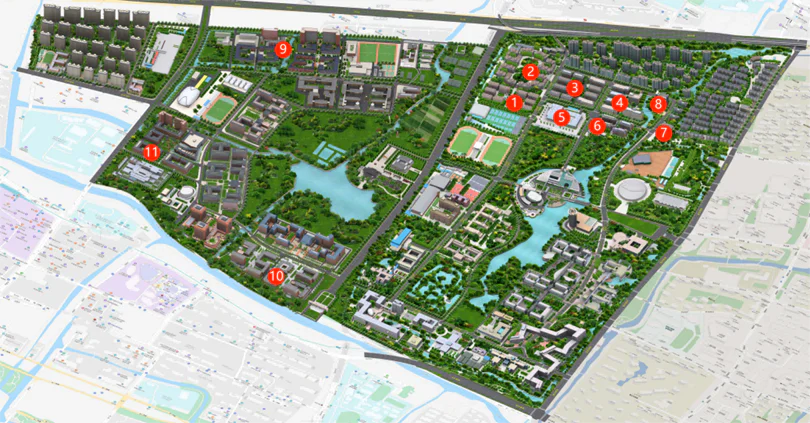
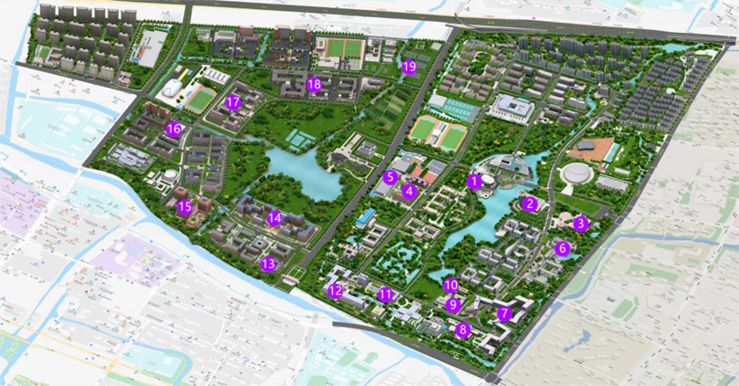

# 校园区域

## 生活园区

上图标注点为浙江大学生活园区主要地标。

|标号 | 地点 |介绍|
|-|-|-|
|1 | 云峰学园 | 大多数工信、材化高、应生、应农、中国画、艺科等大类学生的宿舍园区|
|2 | 蓝田学园 | 大多数工科、建工、医学、药学、海洋等大类学生的宿舍园区|
|3 | 丹青学园 | 大多数人文、外语、小语种、传媒、社科、理试、生环化地、体教、马理论等大类学生的宿舍园区|
|4 | 翠柏学园 | 大三及以上学生宿舍，少数新生也居住于此，含留学生宿舍|
|5 | 餐饮中心 文化广场 | 餐饮中心含5个餐厅，传说是“全亚洲第二大食堂”，食堂前有文化广场，众多组织、社团会在此摆摊进行纳新和活动宣传|
|6 | 白沙学园 白沙综合楼 白沙邮局 | 白沙学园是大三及以上学生宿舍，其一楼有白沙综合楼（公寓管理服务大厅）和白沙邮局、菜鸟驿站 |
|7 | 校医院 | 急诊电话88981120，各科室齐全，甚至有针灸、推拿等科室。|
|8 | 圆正·启真酒店 | 距离浙江大学最近的一家酒店，也常用于举办各类培训和对外高规格活动，实际位于校外|
|9 | 银泉学园 银泉餐厅 | 2022年新建设的宿舍园区，研究生宿舍 |
|10 | 澄月学园 澄月餐厅 | 澄月学园是浙江大学留学生宿舍区，在其一旁有负责留学生管理的国际教育学院，有澄月餐厅（俗称留学生食堂，简称留食）|
|11 | 玉湖学园 玉湖餐厅 | 玉湖学园是竺可桢学院学生宿舍，其附近有玉湖餐厅（又称一万方）和玉湖学生活动中心（尧坤楼）|

## 体育运动区

上图标注点为浙江大学体育运动区域主要地标。

|标号|地点|介绍|
|-|-|-|
|1|网球气膜馆|内有网球场，通常须付费且冬天不开放|
|2|紫云篮球场|距离宿舍区最近的篮球场|
|3|西操场|西操和东操是体育专项辅导课和部分体育课的上课场所，也是体质健康测试的场所、APP打卡的场所，每当夜幕降临，众多浙大学子都会在这里奔跑，挥洒青春的汗水。|
|4|东操场| 体育专项辅导课和部分体育课的上课场所 |
|5|灯光球场|位于东操和西操南面，有篮球场、羽毛球场和篮球场，夜晚灯火通明。|
|6|体育馆|能够容纳超过6000人的超大活动场馆，同时也是亚运场馆之一，一般只用于举办重大赛事或举行重大活动。|
|7|风雨操场|绝大多数非水上体育课开展的地方。风雨操场一层有篮球场，二层有羽毛球场和乒乓球台，两侧的许多小房间里还有舞蹈室、桥牌室等场所，供体育|舞蹈、桥牌、排舞、太极、散打、跆拳道、功守道、瑜伽、健美等体育课程教学使用。非上课时间，同学们也可以到风雨操场进行锻炼。|
|8|游泳馆|游泳课程在此开设，也可以在非教学时段在此游泳健身。|
|9|银泉学园体育场|与银泉学园宿舍园区配套的体育场馆|
|10|玉湖学园体育场|与玉湖学园宿舍园区配套的体育场馆（未建成）|

## 教学实验区

上图标注点为浙江大学教学区域主要地标。

|标号|地点|介绍|
|-|-|-|
|1|东教学区 麦斯威餐吧|含7幢教学楼（东1~东7），绝大多数大一新生课程开设在东教学区，其中： 东一A/B：课程规模一般为50~120人，如思修、C程、大物等； 东二：一般为120人以上大课，如微积分、线代； 东三：一般为电子类课程实验课； 东四：通常开设物理实验课（保卫处位于1楼）； 东六：语言类课程和或通识核心讨论课； 东五和东七分别为外国语学院和数学高等研究院楼。 东教学区内有两层的麦斯威餐吧，较晚下课的学生经常在此用餐 |
|2|西教学区|大多数大二课程开设在西教学区，且一般在西一、西二，西三和西四用作其他研究功能。西教学区有部分教室为音乐教室。|
|3|北教学区|2022年新开设的教学区，少数课程在此上课|
|4|基础图书馆|简称“基图”，位于启真湖盘，是浙江大学最大的图书馆，同学们可以在此自习，图书馆也会定期举办讲座。|
|5|图书馆农医分管|农学、医学类图书的藏馆，也是自习场所之一。|
|6|人文古籍馆|古籍藏馆，有时会举办古籍相关的展览|
|7|计算中心|浙江大学计算机中心，是计算机类课程上机实验课和上机考试的场所。|
|8|金工中心|学生进行工程训练课程（金工实习）的场所；|
|9|化学实验大楼|以“周厚复”命名，是化学实验课上课场所；|
|10|生物实验中心|生物实验课上课场所|
|11|艺博馆|全称艺术与考古博物馆，是浙江大学校内博物馆，日常对学生开放，可预约观展。|

另外在图中西侧的湖北岸，有即将投入使用的浙江大学主图书馆。

## 学科组团与办公区

上图标注点为浙江大学学科组团与办公区主要地标。

|标号|地点|介绍|
|-|-|-|
|1|紫金港剧场 临湖餐厅|简称“小剧场”，原校团委所在地。该建筑内有一能容纳数百人开展活动的会场，同时也用作电影院，日常有电影放映。小剧场一楼、二楼靠近湖边处有临湖餐厅。|
|2|旧管院|管理学院旧大楼，简称“旧管院”，是浙江大学管理学院（旧楼）办公地点，也是浙江大学最高的建筑。|
|3|蒙民伟楼 信息技术中心|香港慈善家蒙民伟博士于2007年捐资建造的大楼，如今属于信息技术中心办公场所。同时，蒙民伟楼中设有数个报告厅，是开办讲座及相关正式活动的不二之选，部分极受学生欢迎的老师在这里开设容量达450人的课程。|
|4|安中大楼 建筑工程学院|安中大楼为纪念浙商赵安中而命名，现属于建筑工程学院办公场所，内有讨论区、咖啡吧等|
|5|海洋试验大厅|隶属于海洋学院|
|6|东五教学楼 外国语学院|东五教学楼是外国语学院办公场所。在东教学区其他教学楼，还零散分布着学校各机关部门的办公场所，如东一学工部，东三人力资源处，东四安保处等。|
|7|农生环组团|自最南端逆时针分别为A、B、C、D、E座 A座：农业与生物技术学院 B座：环境与资源学院 C、D座：实验区 E座：生工食品学院、动物科学学院|
|8|生命科学学院|生命科学学院办公地点|
|9|纳米楼 行政服务办事大厅|浙江大学行政服务中心，办理各项事务的场所，同时也是校领导办公地点|
|10|李摩西楼 校友楼|内有紫金港、玉泉、西溪等多个报告厅，是举办正式会议的场所。|
|11|药学楼|药学院办公地点|
|12|医学科研楼 医学综合楼|医学院办公地点，内有人体博物馆。|
|13|研究生教育大楼|党委研工部所在地|
|14|成均苑 人文社科组团|人文社科组团，含人文古籍馆、文学院、历史学院、哲学学院、传媒学院、马克思主义学院、经济学院、教育学院、公共管理学院和创意中心|
|15|成章楼|管理学院|
|16|海纳苑 理科组团|理科组团，含数学科学学院、物理学院、化学系、心理与行为科学系、地球科学学院等。|
|17|尧坤楼|又称玉湖学生活动中心，校团委办公地点|
|18|开物苑 工学组团| 部分工学学院的组团，含材料学院、化工学院、机械学院、高分子系等|
|19|动物中心 动物医院|校区动物研究中心和动物医院。|

## 自然景观与地标建筑

上图标注点为浙江大学主要自然景观与地标建筑。

|标号|地点|介绍|
|-|-|-|
|1|校友林|月牙楼背后的一片小树林；|
|2|月牙楼|因俯瞰似月牙，因此得名，内有浙江大学校史馆、科技馆。|
|3|管院楼|前文已述|
|4|启真湖|浙江大学东区的一个大湖泊，其名取自于校歌中“昔言求是，实启尔求真”一句。许多水上运动如龙舟、赛艇、桨板、皮划艇等均在此开展。|
|5|湖心岛|启真湖南侧从西四通往东四的湖中小岛。|
|6|南花园|校内保存完好的一块原生态湿地，紫金港校区建成后，学校特地将两幢有300年历史的明末民居移建于此，颇富情调。|
|7|南大门|浙江大学大西区的高大石门，也是浙江大学正门，由浙江大学深圳校友会捐资建造。|
|8|求是大讲堂|浙江大学仿照前身求是书院建成的古色古香的建筑，校内高规格会议、比赛一般在此举行。|
|9|求是湖|与启真湖相对，为大西区内一片人工湖。|

## 浙大道路

### 藕舫路/藕舫南路

位于体育馆前，南北走向，南起农生环组团，北至圆正·启真酒店。其中“藕舫”为浙江大学老校长竺可桢先生的字。

### 迪臣中路/迪臣南路

位于安中大楼前，南北走向，南起医学院，北至蓝田学园。其中“迪臣”是浙江大学前身求是书院创办者林启先生的字。

### 泰和路

即浙大的“北街”，实际上位于校外，在蓝田学园北面，东西走向。其中“泰和”是江西的一个县，也是浙江大学西迁的重要节点。

### 宜山路

位于月牙楼前，东西走向，东起体育馆，西至求是大讲堂。其中“宜山”是广西壮族自治区的一个县，也是浙江大学西迁的重要节点。

### 遵义西路

位于医学院前，东西走向，东其农生环组团，西至医学院。其中“遵义”是贵州省的一个地级市，也是浙江大学西迁的重要节点。
