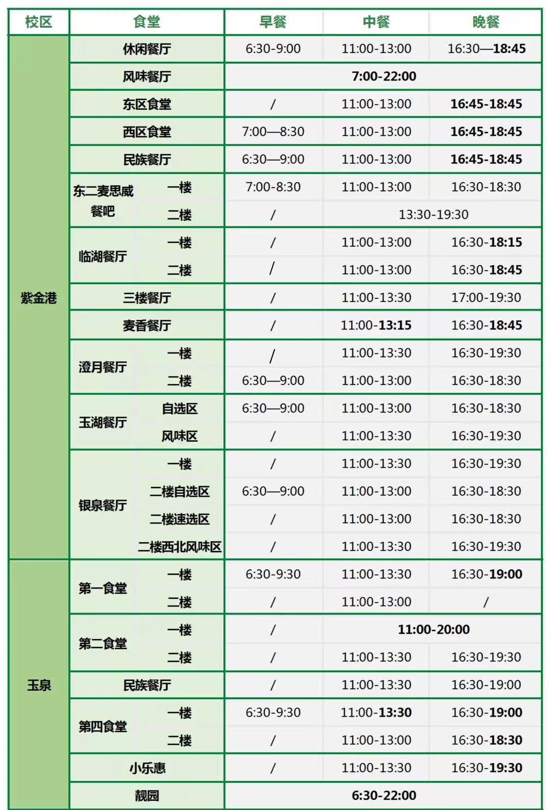

# 饮食消费

## 校内食堂

<!-- TODO：更新这条推文消息，玉湖一楼新开了食堂，玉泉新开了食堂 -->

关于校内食堂的运营时间等，请查看浙大后勤的[推文](https://mp.weixin.qq.com/s/T-2XPmh5olohjkS7EZJa-Q)。

此外，还有紫金港校区银泉餐厅三楼小乐惠（川菜餐厅）在11:00-13:30, 17:00-20:00提供服务。

紫金港校区澄月餐厅三楼留食餐厅（偏杭帮菜风格，不是浙大后勤集团运营）在午餐晚餐时段提供服务。

## 校园卡及消费

- 校园卡的作用
- 支付（可用浙大钉中付款二维码替代）；
- 门禁（可被刷脸替代）；
- 公共卫浴洗澡卡（不可替代）；
- 身份凭证（考试时，可被身份证学生证等替代）。

### 校园卡充值

- 支付宝校园一卡通：打开支付宝→搜索“校园一卡通”→绑定浙大校园卡→完成充值。
- 浙大校园卡APP
- 校园卡服务部： 位于紫金港校区大食堂一楼（休闲餐厅南门门口），可现金充值。

### 校园卡补办

在大食堂一楼校园卡服务部有校园卡自助补办机，每次补办需支付20元。校园卡补办后，原卡自动失效。

### 消费预估

- 饮食：日均40元×30天 = 1200元（含水果零食等）；
- 日用缴费：250元（包括水电、桶装水、网费、电话费等）；
- 日用品添置：200元；
- 书籍/娱乐消费：300元；
- 合计：约2000元，须添置其他大件物品另算。

## 校内娱乐

- 毕至居：DIY厨房，前文已述；
- 餐饮（篇幅所限未一一列举）：
    - 茶饮类
        - 麦斯威： 浙大后勤运营的咖啡、茶点品牌；
        - 星巴克： 位于澄月、银泉；
        - 瑞幸咖啡： 位于白沙、文学院、玉湖；
        - 库迪咖啡： 位于小剧场教超；
        - 古茗： 位于银泉、玉湖教超，校外也有门店
    - 快餐类
        - 肯德基： 位于银泉；
        - 麦当劳： 位于东二门外；
- 小剧场：周末常常有各类演出、电影点映等；
- 艺博馆：浙江大学艺术与考古博物馆，前文已述。
