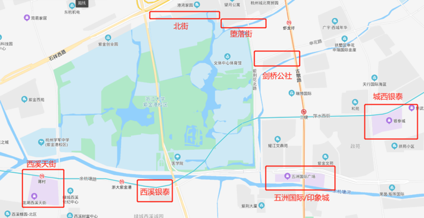

# 杭城掠影

## 校园周边

### 北街（泰和路）

泰和路，因其位于紫金港校区最北面，因此也被叫作“北街”，毗邻港湾家园校区。北街有众多日用商铺，与学生相关的主要有：北街烧烤、京东派、各种咖啡吧、文印店、理发店、日用品商店等。

### 堕落街（龙宇街）

龙宇街，位于紫金港校区宿舍区门（东1门）门前，美食商铺林立，因此被称为堕落街。堕落街的美食主要有：奶茶、麻辣烫、粥、炒冷面、烙饼、烧烤等，主要是一些小吃和小店铺，消费不高，通常在10~30/人次。

### 剑桥公社

剑桥公社，是浙大正门（东2门）申花路的一片区域，其中娱乐商铺较多，包括：KTV、桌游室等，也有非常多的烧烤和美食店铺。

### 购物广场

- 城西银泰；
- 五洲国际/印象城；
- 西溪银泰；
- 龙湖西溪天街。

## 杭州景点

