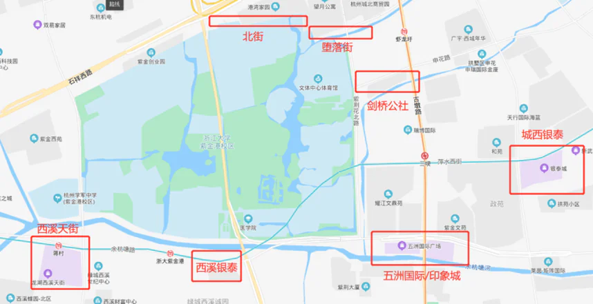

# 杭城掠影

## 校园周边

### 北街（泰和路）

泰和路，因其位于紫金港校区最北面，因此也被叫作“北街”，毗邻港湾家园小区，港湾家园住有部分浙大教职工。
北街有众多日用商铺，与学生相关的主要有：北街烧烤、京东派、各种咖啡吧、文印店、理发店、日用品商店等。
可以通往北街的校门现有蓝田北侧门、校医院门（东1门）。

### 堕落街（龙宇街）

龙宇街，位于紫金港校区宿舍区门（东1门）门前，美食商铺林立，因此被称为堕落街。堕落街底商多为茶饮、小吃、快餐等，人均在10-30元左右，在堕落街用餐需要注意食品安全问题。

### 剑桥公社、浙港国际

剑桥公社和浙港国际是浙大东2门外的一片区域，其中娱乐商铺较多，包括：KTV、桌游室等，也有非常多的烧烤和美食店铺。

### 商场

紫金港周边商场比较多，杭州城西区域的主要商场大多都离紫金港比较近，浙大同学比较常去的包括：

- 城西银泰；
- 五洲国际/印象城；
- 西溪银泰；
- 龙湖紫荆天街；
- 龙湖西溪天街。

## 杭州景点

### 杭州西湖

西湖是不必介绍大家也知道的杭州必游之地。事实上，如果单纯只是围着西湖逛一圈，那么其实是有些乏味的——毕竟就是一个湖而已。西湖真正有韵味的地方在于它周边的景观。

在其东北面有繁华的商贸区——湖滨银泰，也是杭州人流量最大的商区；在其北有如浙江博物馆孤山馆区、西湖博物馆等展馆，也有著名的白堤、断桥残雪；在其西面有著名的苏堤、杨公堤；南面有雷峰塔、太子湾，还有每晚的西湖音乐喷泉；中央有游船和三潭印月。在其背后的山中，有龙井村、虎跑泉、灵隐寺、九溪烟树。这些自然、人文的景观与西湖厚重的历史底蕴一道，铸就了杭州西湖的美名。
若有兴趣到西湖一游，建议乘坐地铁至龙翔桥站。

### 西溪国家湿地公园

浙江大学紫金港校区原来就属于西溪湿地的一部分，而西溪湿地公园是西溪湿地最大的一块，是国家级5A景区。这里除了湿地景观以外，还有许多人文建筑。到此游览，可感受梦想中江南水乡的风土人情。前年3月，习近平总书记就曾到此进行湿地保护的考察。

### 浙江大学之江校区

之江大学原是基督教美北长老会和美南长老会在中国杭州联合创办的一所教会大学，也曾是中国的十三所基督教大学之一，1958年归入浙江大学，现为法学院所在地。之江校区是全国重点文物保护单位，同时也是浙江大学最美的校区。

### 钱江新城/城市阳台

钱江新城是杭州市的中央商务区（CBD），类似于上海的外滩，杭州市政府、杭州大剧院都在这里。在钱江新城的市民广场，有一个延伸至钱塘江上的城市阳台，在这里可以夜观江景，看见对岸萧山区的奥体博物馆。每周二、五、六晚的19:30和20:30，这里将会有城市灯光秀，各位可以乘坐地铁至4/7号线市民中心站观看。

### 良渚遗址

良渚文明是人类早期文明之一，是长江流域文明的重要发端。良渚遗址也在2019年被列入世界遗产名录。不过良渚博物馆目前尚未通地铁，前往参观交通较为不便。

### 其他景点

杭城还有非常多的景观，譬如之江校区附近的宋城，京杭大运河边的拱宸桥、武林广场，西湖周边的河坊街、小河直街等文化街区，或是奔涌的钱塘潮，远在淳安县的千岛湖，乃至西湖西侧的群山、郊外的径山、北湖，都是不错的景观，有待各位在未来慢慢探寻。

## 杭州交通

紫金港校区位于西湖区城西区域，虽不在杭州市中心，但其周边生活配套丰富，交通方便，距离杭州老城区也并不远，以下介绍几类常用的交通工具。

### 电动车（小龟）

校内和周边出行主要靠电动车，这部分前面章节已经叙述，这里不再赘述。建议同学们无论是在校内还是校外，骑电动车都戴好头盔，遵守交通规则，注意行人及其他车辆，避免事故发生。

### 地铁

紫金港校区附近有两条地铁线路，2号线和5号线，其中5号线浙大紫金港站在紫金港校区南大门外。浙大紫金港站开通运营之后的很长一段时间内，由于南大门尚未修好，因此有“到浙大紫金港不要在浙大紫金港站下车”的戏称。

乘坐地铁使用银联闪付首单一般都会有优惠价格。

### 公交

学校附近公交站点和线路都很多，其中89路覆盖了紫金港校区和玉泉校区往返的区间。

### 水上巴士

在西3门外，紫金港校区南侧的余杭塘河畔，有一个码头叫杨家桥，在这里可以乘坐水上巴士到达信义坊，并且可以换乘其他水上巴士线路，在余杭塘河和京杭大运河上观赏江南水乡的风光。杭州的城市水系治理得很好，河道两侧绿化令人心旷神怡，如果不赶时间的话不失为一种不错的交通方式。
