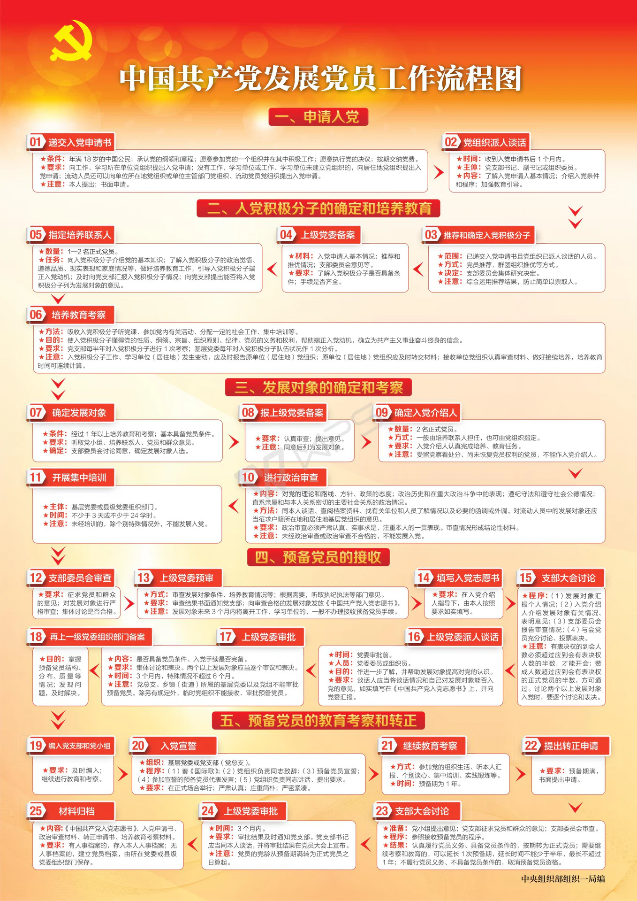

# 入党专题

军训期间，各连队将建立临时团支部、临时党支部，年满18周岁，有意向加入中国共产党的学生可在军训期间递交入党申请书。

## 入党流程

从递交入党申请书至成为中国共产党正式党员，共须经历25个流程，具体见下图，亦可参看参考资料。

在军训期间，学生主要完成入党流程的第一步——递交入党申请书，此时学生称为“入党申请人”。军训结束后，上级党组织将派人开展入党谈话。谈话后，经党员推荐和团支部内推优，部分优秀入党申请人可成功推优称，经上级党委同意并备案后，成为“入党积极分子”，接受进一步的考察和培养（至少持续1年）。后续培养流程见上图。

> 上图中“入党申请人”“入党积极分子”“发展对象”均不能称为个人的“政治面貌”，只有“共青团员”“中共预备党员”和“中共党员”等才是政治面貌。

## 申请书

### 样例（以届时通知为准，不得照搬照抄！）

**入党申请书** 
<blockquote>标题，居中写，一般写“入党申请书”</blockquote>

**敬爱的党组织：**

    称谓，即申请人对党组织的称呼，在标题下第一行，顶格写，后面加冒号。

&emsp;&emsp;我以十分激动而恳切的心情，郑重向党组织提出入党申请——我志愿加入中国共产党，愿意为共产主义而奋斗终身。

&emsp;&emsp;正如党章指出：中国共产党是中国工人阶级的先锋队，是中国人民和中华民族的先锋队，是中国特色社会主义事业的领导核心，代表中国先进生产力的发展要求，代表中国先进文化的前进方向，代表中国最广大人民的根本利益。党的最高理想和最终目标是实现共产主义。中国共产党以马克思列宁主义、毛泽东思想、邓小平理论、“三个代表”重要思想、科学发展观、习近平新时代中国特色社会主义思想作为自己的行动指南。

    正文第一部分写自己对党的性质、作用、地位、历史等方面的认识。

&emsp;&emsp;我之所以想加入中国共产党……

    正文第二部分要联系实际谈自己对党的认识，自己的入党动机和对党的态度，反映自己的真实思想，鲜明地表达入党愿望，切忌脱离自己思想实际，抄书抄报，空谈一般化理论。

&emsp;&emsp;作为一名团员……

    正文第三部分写自己的成长经历和思想、工作、学习、作风等方面的情况，以及自己的优缺点和自己今后的努力方向。这部分应尽量联系一些具体情况来写，不要空空洞洞。

&emsp;&emsp;为争取早日加入党组织……

    正文第四部分写对待入党的态度、决心，及如何以实际行动争取早日加入党组织。

&emsp;&emsp;请党组织考验我！

&emsp;&emsp;此致

敬礼！

    结尾。一般可写“请党组织在实践中考验我”，或“请党组织审查”“请党组织考验我”“请党组织看我的行动”等作为结束。正文写完之后，加上“此致、敬礼”等用语，其中“此致”空两格，不加标点，“敬礼！”顶格。

申请人：*** 

20**年*月*日

    署名和日期。在正文下一行居右签上申请人的姓名（或盖章），在姓名下面注明写入党申请书的日期，具体到日。尤其要注意的是日期不能忘。
附：申请人基本信息

### 注意事项

1. 入党申请书要用**钢笔或签字笔（用黑墨水）**按规定格式书写，不要用圆珠笔、铅笔，字迹要工整、清楚，力戒错别字。
2. 入党申请书应写在**浙江大学方格稿纸**上，字数一般在**1500字以上（各连要求不同）**。
3. 要**真实反映**自己的思想和认识。在谈对党、对共产主义事业的认识和要求入党的动机时，要倾吐自己真实想法，要向党组织交心，要讲真心话。要以对党忠诚老实的态度写明自己的有关情况。对自己的历史和本人有关的情况，要坦率地、如实地向党组织写明，不能有半点隐瞒，更不能弄虚作假。要做政治上的诚实人，这也是对要求入党者的一个起码要求。
4. 要**朴实、庄重**。写入党申请书不要追求华丽的辞藻，要真正联系自己的思想实际，写出思想感情来。
5. **严禁抄袭**。
