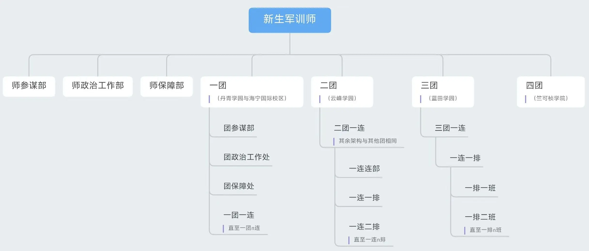

# 组织架构

2024级新生军训相对以前有所调整。浙江大学全体参训学生整编为1个军训师，下设4个团，分别对应丹青学园（含海宁国际校区）、紫云碧峰学园、蓝田学园和竺可桢学院。不同团部连队数量不同。原学院中大类班级按照顺序依次组成若干连队，连队人员调整后缩减成5个行政班组成，各连队人数在130人左右。

## 师部团部

### 人员组成

军训师师部是新生军训师的最高领导单位，分为参谋部、政治工作部和保障部。师部成员由校园两级党委、团委、学工部、研工部、人武部、安保部等众多部门教师及承训部队主要领导整编而成，也包含部分高年级学生骨干。 团部是各团的最高领导单位，相应划分为参谋部、政治工作处和保障处，主要由辅导员、机关骨干及自主报名招募的学生骨干组成，同时择优招募参训学生进入团部工作。

#### 师参谋部/团参谋部

师团司令部主要负责组织安排军训期间学生军事训练任务，组织动员大会、消防演练、激光打靶、军训阅兵式等大型军事项目。

#### 师政治部/团政治处

师政治部/团政治处主要负责军训期间学生理想信念教育、宣传动员等工作，负责通讯稿评级、内务卫生检查、大型文体活动（如合唱比赛）举办等工作。

#### 师保障部/团保障处

师保障部/团保障处主要负责军训期间学生后勤保障工作，包括物资分发、经费下拨、餐饮安排、校医院对接等。

## 连队组织

### 连队组成

每一军训团下设若干连队，每一连队大约由5个行政班组成，130人左右。每一连队下设若干排（2~3个，由承训官兵数量决定），每排下设若干班，每班人数约为10人。具体的架构设置各团间可能有所不同。各连的配置是1名官兵+1名指导员+2名学生副指+1名副连。今年每连仅有1位承训官兵。

### 带训骨干

1. **指导员1人**：为浙江大学辅导员，主要负责连队事务统筹、思想引领、入党动员、心理建设、安全稳定等工作；
2. **副指导员2人**：均为报名选拔的学生骨干，负责连部干事管理、通讯稿评级、文体活动等工作；
3. **连长1人**：由部队承训官兵担任，主要负责连队军事训练任务；
4. **副连长1人**：由学校退役士兵协会、国旗仪仗队等组织学生担任，辅助连长完成军训任务，同时负责连队内务卫生、后勤保障等工作；

### 连队骨干

连队内选拔部分全程参训学生担任以下骨干成员：

1. **旗手1人**：负责擎举连旗走在队伍前方，其中每一军训团一连须选拔旗手2名，一人举团旗，一人举连旗；
2. **每排副排长1人**：又称“排副”，辅助连长、副连长及排长开展军事训练及各排考勤工作；
3. **每班班长1人**：与排副职能类似，负责各班考勤等任务；
4. **卫生员2人**：须参加卫生员培训并完成考核，掌握急救技能。军训时携带医药箱，负责处理应急医疗事件（如学生中暑、擦伤等）；
5. **其他骨干**：各连队按需要设置其他职务，如负责管理各班内务的副班长，负责收集各班通讯稿的宣传员等。

### 连部干事

1. **职责**：主要负责连队内组织宣传等方面工作（如撰写、审核通讯稿等），仅需参加早操和晚间活动，无需参加上午、下午的操课（即军事训练），在连队办公室内工作，特长突出的学生亦可选拔进入各团团部工作；
2. **要求**：连部干事须经过选拔，名额优先给到因身体原因不适合全程参训的学生，其余自主报名的学生需要有文字、图片设计、绘画、书法、摄影等特长，每连约5~7人；
3. **成绩评定**：连部干事参加军训属于“半训”（见后文），最终成绩不得高于90分，无法评定为“优秀”，绩点最高为4.5（见“学习篇”）无法获得嘉奖。
