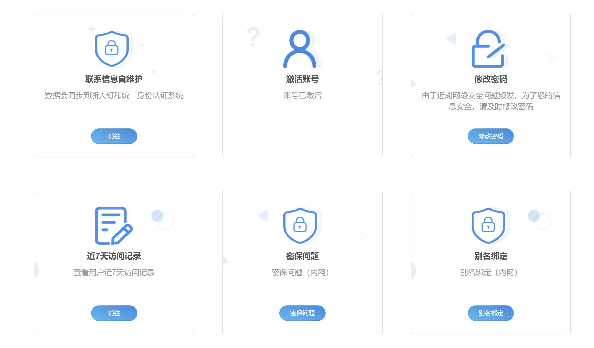
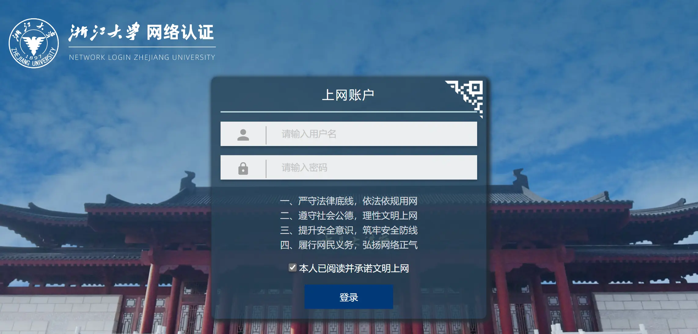

# 从0开始激活通行证，畅游浙大

> 作者：@好神奇

该指南用于帮助计算机基础较为薄弱的同学从0开始完成浙江大学统一身份认证激活、VPN激活、WebVPN使用、浙大钉注册登录等系列注册报到流程，其中：

- 浙江大学统一身份认证：即浙江大学通行证（账号及密码），可以凭借此账户登录浙江大学绝大多数平台，是最重要的网络身份信息之一

- VPN：虚拟专用网络的简称，此处可理解为浙江大学校内网络

- WebVPN：在校外可以访问浙江大学校内网络的简易网页平台

- 浙大钉：即“钉钉APP”浙江大学企业版，是浙江大学校内师生沟通交流最重要的APP

## 激活通行证账号

### Step1：扫描“个人自助服务系统”二维码

录取通知书附带报到手册中“二、网上注册”部分第一个二维码为“个人自助服务系统二维码，扫描后进入**浙江大学统一身份认证**界面。亦可点击访问[该网址](https://zjuam.zju.edu.cn/zjuam-main/)。

输入通行证账号和初始密码，登录个人自助服务系统。

- 账号：即个人学号

- 初始密码：zju2024加证件号后四位

### Step2：激活通行证、修改密码

点击“激活账号”，并查看和确认个人信息是否有误，无误后确认激活。

点击“修改密码”，进行初始密码修改。注意：统一身份认证账户极其重要，请务必保证账号的安全性，务必保证熟记账号和密码。

### Step3：联系信息自维护（非必要）

点击“联系信息自维护”，进入信息维护页面，主要为与通行证绑定的电话信息的维护。

- 部分学生如初始绑定的手机是家长手机，请**务必修改为个人手机**

- 通行证绑定的手机号码同时应当是浙大钉APP注册登录的手机号码，否则可能无法收到浙江大学的组织邀请，无法完成后续注册报到流程。

## 激活上网账号与VPN

### Step1：登录myvpn

访问[浙江大学VPN系统](https://myvpn.zju.edu.cn/)

点击激活账号，跳转至浙江大学统一身份认证，进行激活。此处激活的是**上网账号**，激活后**初始上网账号密码跟统一身份认证一致**。

需要说明的是，上网账号与通行证账号属于独立的两套账户密码，仅初次激活时账号密码一致，若后续修改通行证密码上网账号密码并不会随之更新，反之亦然。

### Step2：激活套餐与缴费

在套餐信息中点击“启用”，开启VPN套餐（默认为10元/月）

VPN套餐开启后，有1个月的免费试用期，试用期过后需要缴费方能继续使用。缴费一般需要在该系统中绑定校园卡，校园卡将在注册报到时发放，此处不述。

### Step3：开通邮箱、取别名（非必要但建议）

左侧菜单栏点击“开通邮箱”，可开通浙江大学邮箱，默认邮箱地址为**学号@zju.edu.cn**,浙江大学邮件系统[请点击此处进入](https://mail.zju.edu.cn/)。

每个邮箱可设置1个邮箱别名，且仅可设置1次。邮箱别名即可以将原“学号@zju.edu.cn”的邮箱地址转为“自定义@zju.edu.cn”，一般建议采用姓名全拼、缩写等，如[huangshaoqi@zju.edu.cn](mailto:huangshaoqi@zju.edu.cn)

邮箱别名与原始邮箱地址完全等效，发送邮件时，收件人为“学号@zju.edu.cn”或“自定义@zju.edu.cn”，收件人均能收到邮件。

关于邮件系统和邮件礼仪，可以查看[这里](./learning/email_etiquette.md)。

## 校内网络登录

> 仅介绍最简单的WiFi登录，有线网络请阅读[网络服务指南](./life/network.md)

假如你在浙江大学校内，则可以搜索到以下无线网络（WiFi）

- ZJUWLAN

- ZJUWLAN-Secure

- ZJUWLAN-Guest

新手小白可以直接选择ZJUWLAN并连接，此时浏览器会自动跳出[以下登录页面](https://net3.zju.edu.cn)，输入账号和密码（上网账号密码，**初始状态下与通行证账号和密码相同**）即可连接成功，访问浙江大学校内网络。

## 校外网络登录

### 校外网络登录流程

> 仅介绍最简单的WebVPN登录，其他方式请阅“[网络服务指南](./life/network.md)

假如你在浙江大学校外，但是又想要访问浙江大学内部网络，则需要通过WebVPN进行访问。

访问[浙江大学WebVPN](https://webvpn.zju.edu.cn/)

输入上网账号和密码（初始状态下与通行证账号和密码相同）并登录。

- 部分网页已经直接列入“校内资源导航”中，可以直接访问

- 如希望访问其他网页，可以将网页原地址复制下来，如：www.cc98.org ，粘贴至右上角“自定义域名”处，回车键入即可访问。

### 访问内网小tips

#### 内网访问标志
非WebVPN状态下访问某网址，若网址输入无误，且跳出以下页面，说明需要内网访问，请将网址复制到WebVPN中访问：

- 页面显示`您没有权限访问`，并出现登录窗口，如[共青团浙江大学委员会](https://zjutw.zju.edu.cn/main.psp)
- 页面显示`该网站仅限校内,请使用webvpn访问`，如[浙江大学党委组织部](http://dwzzb.zju.edu.cn/)
- 页面显示`无法访问此页面`，如[浙江大学本科生院办公网](http://bksy.zju.edu.cn/main.htm)
> 因为WebVPN未使用HTTPS，如果出现访问失败的情况，可以看看原网址前缀是否为`https`,如是，可以改为`http`后再进行尝试

#### 校外访问限制类型
浙江大学各网站对校外访问的限制一般分为以下几种情况

- 完全不限制校外访问（校内与校外可浏览内容完全一致），如[浙江大学本科招生网](https://zdzsc.zju.edu.cn/)
- 不分校内校外，要求登录浙江大学通行证，变相限制访问，如[本科教学管理信息服务平台](http://zdbk.zju.edu.cn/)
- 使用一个网站，部分内容需要内网访问，如[浙江大学党委学生工作部](http://www.xgb.zju.edu.cn/)
- 分为中文网/门户网和办公网，中文网/门户网对外开放，办公网限校内访问，如[浙江大学竺可桢学院中文网](http://ckc.zju.edu.cn/)和[浙江大学竺可桢学院办公网](http://office.ckc.zju.edu.cn/)
- 完全限制校外访问，仅校内网络或WebVPN可访问，如[浙江大学党委办公室、校长办公室](http://office.zju.edu.cn/)

#### 网址转换

WebVPN网址转换为原始网址，需要删去网址中的`-zju-edu-cn.webvpn`和`:8001`，将多于的`-`转为`.`且`:8001`后的后缀保持不变，如：

**WebVPN下网址：** http://www-xgb-zju-edu-cn.webvpn.zju.edu.cn:8001/2024/0713/c53018a2945913/page.psp

**对应初始网址：** http://www.xgb.zju.edu.cn/2024/0713/c53018a2945913/page.psp

## 浙大钉注册

### Step1：下载并注册浙大钉

录取通知书附带报到手册中“二、网上注册”部分第二个二维码为浙大钉下载二维码，手机扫描后即可下载。苹果手机可以直接在App Store搜索下载。

下载后自行注册浙大钉账号，注意：

- 浙大钉账号（手机号）需要与前文通行证绑定的手机号一致，否则无法进入浙江大学组织

- 浙大钉密码和通行证密码互相独立，建议与通行证密码一致，以免遗忘

### Step2：加入浙江大学企业

在线上注册期间（8月1日-8月10日）你的浙大钉会收到浙江大学的企业邀请，此时点击“同意”即可加入浙江大学组织。

- 暂未收到邀请请勿着急，可以稍微等一等

- 长时间未收到邀请，请及时确认浙大钉登录的手机号与通行证绑定的手机号是否一致，如不一致，可选择换一个号登录浙大钉，或按照前文流程，登录个人自助服务系统，进行信息维护，修改绑定手机号

- 绑定手机号修改后，浙江大学会重新向新绑定的手机号发送邀请，请耐心等待

- 如果一不小心手误点到了“拒绝”，请及时联系信息技术中心网上注册技术咨询电话:0571-87951669或邮箱[xwmaster@zju.edu.cn](mailto:xwmaster@zju.edu.cn)
