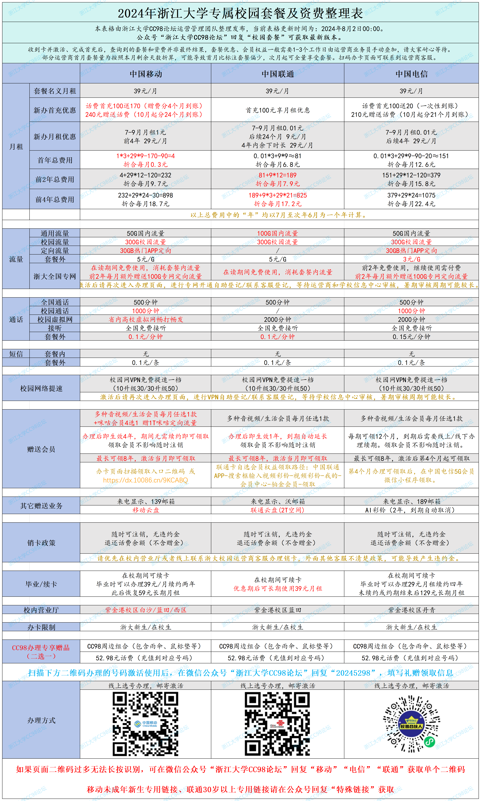

# 校园套餐电话卡信息汇总

**首先提醒大家，校园套餐电话卡只是一张套餐比较优惠的电话卡，并不是必须办理的，不办理专属套餐电话卡不会对你正常在校学习生活产生任何影响**。本文转载于浙江大学CC98论坛官方 ，原文：[https://www.cc98.org/topic/5943030](https://zjuers.com/rd?url=https://www.cc98.org/topic/5943030&mode=1)

此页面与在浙大钉APP线上注册时可选的电话卡为同一套餐，如果已经在浙大钉线上注册时办理，此处无需重复办理。下方所述额外礼赠仅限本页面扫码办理可享，其余渠道办理的不可领取。

在往年的新生季中，推销办卡、虚假宣传的情况时有发生，既给新生和其他同学造成了困扰，也阻碍了运营商之间公平竞争。作为服务于广大师生的学生组织，CC98运营管理团队也一直在尝试解决该问题。

为此，CC98今年与三家运营商（移动、联通、电信）一起合作，整理经过运营商确认的套餐和价格信息，为大家提供准确的校园电话卡套餐对比，解答大家常见的问题。我们提供三家运营商套餐的内容对比表格和辅助选择的问卷。我们也为通过CC98与运营商合作专属链接办卡的同学提供了额外的优惠（CC98周边组合套装/52.98元话费 二选一；周边组合套装必包含CC98晴雨伞和CC98大鼠标垫，其他周边随机加赠）。有需要的同学可以选择合适的渠道自愿办理，如果其他渠道承诺的套餐和优惠内容与98公布内容不符，请保持警惕，如有需要可以回帖咨询。

我们希望通过提供公平竞争的环境让三家运营商可以更好的聚焦到自己的套餐和服务品质上，真正的惠及到广大用户。即日起至9月底期间，同学如果遇到了虚假宣传校园套餐内容、诱骗办卡的情况，可以通过我们和三大运营商合作的反馈通道反馈，[反馈链接](https://jsj.top/f/c4BuN4)，我们会敦促运营商做好注销工作并对有关人员作出处理。

问题咨询与恶意营销、欺骗反馈投诉：[https://jsj.top/f/c4BuN4](https://jsj.top/f/c4BuN4)

98专属渠道办卡额外奖励登记：[https://jsj.top/f/OIybhr](https://jsj.top/f/OIybhr)

运营商选择辅助测试量表：[https://jsj.top/f/wfuDkz](https://jsj.top/f/wfuDkz)

注意：由于此前部分运营商计划今年涨价售卖，已在其他平台涨价售卖了部分套餐。在公平公开竞争的情况下，以下表格为CC98与运营商多次沟通后为大家争取后的最新优惠价格（其他渠道也将同步降价，大家可以自由选择），价格基本与往年持平，如果扫码后的办理页面显示的价格或套餐内容与下表不符，请以下方表格为准。

**收到卡并激活、完成首充后，查询到的套餐和资费并非最终结果，套餐优惠、会员权益一般需要1-3个工作日有运营商业务员手动叠加，请大家耐心等待。部分运营商首月套餐量为按照本月剩余天数折算，可能导致比标注偏少，次月起可全量享受套餐。浙大全国专网、校园网络提速，请根据办卡页面提示（或联系办卡页面客服）进行登记，等待运营商提交、学校信息中心审核后生效，暑假期间审核周期可能较长。**

**运营商客服联系方式：扫描对应运营商办卡二维码，添加页面上显示的客服联系方式。**

### 2024年浙江大学专属校园套餐汇总

## 常见问题&解答

#### **1. CC98为什么与运营商合作？**

答：CC98论坛作为校园论坛坚持将服务好广大师生作为第一目标。此前部分年份，98与单家运营商进行合作，但是无法解决新生季电话卡推销混乱的情况。因此我们在去年拒绝了所有运营商的合作意向，希望能够更好的作为“局外人”，给大家一个更好的曝光和发声渠道。但是实践表明，混乱推销和不同运营商代理间的互相抹黑和欺诈推销并未减少。因此我们今年尝试与三家运营商都进行合作，给运营商一个公平公开进行竞争的环境。**价格上，本来今年运营商计划统一涨价到39元月租，但是经过CC98团队的不断争取和运营商之间公平竞争的推动，价格多次下降，目前价格基本与往年持平，且这一降价不仅限于CC98，将适用于全部渠道办出的浙大校园套餐，部分降价前已售套餐也将享受最新优惠。**运营商在额外礼赠提供上对98论坛进行支持，且之后会为98论坛举办校园活动提供更多支持。

#### 2. 额外礼赠的价值是怎样确定的？

答：**52.98元的礼赠价值并不是CC98能争取的上限。**但是我们也希望部分通过暑期兼职、代理销售电话卡赚取生活费、学费的本校同学能够在公平竞争、合理推销的情况下，给客户更高的让利的同时获得可观的收入。如果98提供的礼赠价值过高，可能会导致兼职同学的收益过低，从而使欺诈推销等行为频发，因此我们确定了一个较为适中的礼赠价格。如果有本校同学愿意以更高的礼赠优惠给你办卡，在确认真实可靠的情况下（建议通过钉钉消息核实浙大学生身份），也希望大家支持他们（如果兼职同学提供的礼赠金额大于80元请注意风险，如果超过100元请务必谨慎考虑）。

#### 3. CC98专属的额外礼赠如何领取？

答：在扫码办理-收到电话卡-完成激活后，大家可以通过[问卷](https://jsj.top/f/OIybhr)领取奖励。奖励为CC98周边组合/52.98元话费二选一，CC98周边通过邮寄方式发放，话费在开学后统一充值到账。注意，仅限通过CC98扫码办理的用户可以领取专属礼赠，其他渠道办理的无法通过审核。如果遇到问题或者需要修改信息，请邮件联系contact@cc98.org。

#### 4. 对于新生来说，运营商的校园套餐一定要办理吗？

答：运营商办理的是用来上网、打电话、发短信的电话卡。而校园卡是学校在报到时发放的用于在校内刷卡消费的卡片，报到当天会统一发放。**两者没有任何关联**，请警惕部分推销人员的欺骗性话术。学校专属的电话卡套餐并非必须办理，只是相比于普通的电话卡更加优惠，适合有需求的同学自愿办理。不办理学校专属套餐的电话卡不会影响：报到、使用校园卡、选课（浙大选课为先选后抽的“彩票机制”，与网速无关，“秒课”等说法为夸大宣传）、办理学校银行卡、和老师同学联系沟通、查询各类学校信息、访问校园网等等。简言之，**不办理专属套餐电话卡不会对你正常在校学习生活产生任何影响**，如果没有需求你可以继续使用自己已有的电话卡，不必新办套餐。推销人员通过推销会获取一定佣金，请务必警惕各类欺骗诱导话术。

#### 5. 什么是通用流量、校园流量、定向流量？

答：通用流量指的是全国都可以使用的流量，不限时间地点。校园流量只能在校园区域（不仅限于浙江大学内）使用。定向流量则为某些特定APP、服务可以使用的流量。流量扣减的优先级一般是定向流量->校园流量->全国流量。全国流量在寒暑假等不在校园内的时段较为重要。类似的，在校园区域拨打电话，将优先消耗校园通话时长。

#### 6. 什么是浙大全国专网？

答：校内有许多资源和服务是需要校园网才能访问的，例如CC98论坛、部分的文献数据库、ETA、综合服务网等。在校外没有校园网环境的时候，同学们可以通过RVPN、WebVPN等方式访问校园网络，但是较为复杂。今年专网完成了升级，可用区域扩大为全国（不含港澳台），并且兼容了4G。开通了浙大全国专网服务的手机卡，可以在使用4G/5G流量时，直接访问校内资源。无论身处校园内外，都可以不再通过VPN拨号等复杂流程，更快捷、更安全地访问校园内网的资源。手机也可以开热点将网络共享给电脑，这样电脑也可以访问校内资源。如果手机套餐内有专网定向流量，将优先消耗专网定向流量；如果没有定向流量，或定向流量已经用尽，将消耗通用流量/校园流量。

#### 7. 校园套餐电话卡是否有合约期，销卡是否会产生违约金？

答：目前三家运营商均承诺随时可注销，无违约金。注销时未用完的话费将会退还（赠送的话费不可退）。

#### 8. 校园网络提速一档是什么？

答：使用校园网络（Wifi或者有线）需要向学校信息中心付费，套餐分为每月10/30/50元三档，对应不同的速度和同时使用设备数。办理校园电话卡套餐后，支付10元可以享受30元套餐，支付30元可以享受50元套餐。

#### 9. 只有新生才能办理吗？老生可以办理吗？

答：校园套餐不限新生老生，在校生均可办理。部分运营商支持已毕业但不满30岁的用户办理，可以尝试申请，以实际审核结果为准。

#### 10. 如何联系到运营商客服？

答：扫描对应运营商的办卡二维码，页面上有客服联系方式。

#### 11. 可以携号转网改套餐吗？

答：杭州本地手机号、无套餐绑定、符合转出条件的号码，可以咨询客服是否可以成功携号转网，具体是否成功以客服核实结果为准（客服反馈大部分咨询的同学此前都是校园套餐，或有减免优惠，成功率比较低）。携号转网不属于新办卡，不符合运营商奖励政策，不能领取98额外礼赠。当然，换号的麻烦肯定远大于礼赠的价格，有携号转网需求的同学可以优先尝试一下。

#### 12. 为什么激活后查到的套餐与表格中不同？

答：收到卡并激活后，请确保自己已经完成对应金额的首充（部分运营商为申请时已付款首充）。此时查询到的套餐和资费并非最终结果，套餐优惠、会员权益一般需要1-3个工作日有运营商业务员手动叠加，请大家耐心等待。浙大全国专网、校园网络提速，请根据办卡页面提示（或联系办卡页面客服）进行登记，等待运营商提交、学校信息中心审核后生效，暑假期间审核周期可能较长。如有问题可扫描对应运营商的办卡二维码，页面上有客服联系方式（请优先联系页面的校园营业厅客服，运营商的其他公开渠道客服并不一定了解校园优惠政策）。
