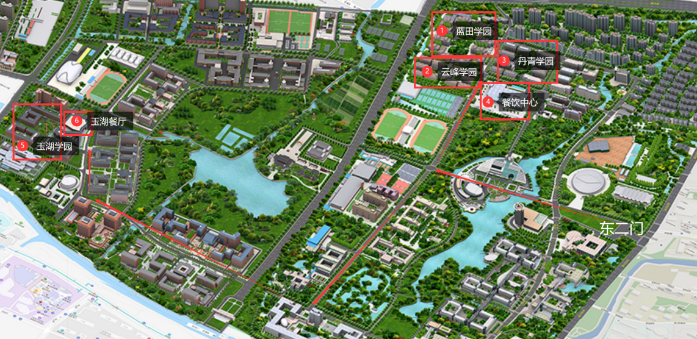

# 报到流程

- 乘坐校车或自行前往宿舍区。在宿舍区（学园）办理报到和入住手续。

- 寻找穿着学长组文化衫的学长学姐，他们会告诉你报到的具体手续，并引导你登记签字、关注公众号、领取院衫等。学长组是学校统一安排负责迎新及新生始业教育、大一学年培养的浙大学生，请认准学长衫，未穿着对应服装的不是官方人员。

## 宿舍相关

### 信息登记

开学报到前，学生可前往“浙江大学公寓管理服务中心”公众号“新生服务”栏目，登记住宿需求。填写个人生活习惯，申请空调，购置卧具。
> 由于大多数人填写的“生活习惯”（如十二点前睡）在实际操作上都不太真实，且宿舍协调较为困难，因而实际效用欠佳。

### 查看住宿安排

新生报到前1~3天，学生可在“新生服务”栏目内查看自己即将入住的寝室，包括宿舍楼、宿舍号和床号。无特殊情况，寝室一般不进行调整，但床位可宿舍内部协商调整。

### 入住办理

新生报到时，前往所居住的寝室楼下，寻找宿舍管理员进行身份登记，填写住宿卡（需1寸照片1张），领取宿舍钥匙（交付押金20元）和学生信息卡，办理校园卡。完成以上事项后，即3可入住寝室。

## 注册与物资领用

### 学籍注册

学生须前往对应学院指定地点完成报到和学籍注册，领取相关材料。

### 军训服装

学生须前往对应学园指定地点（另行通知）领取军训服装，包括迷彩T恤1件、迷彩外套1件、迷彩裤1条、迷彩帽1顶，迷彩鞋1双，若不合身须现场更换。其余装备如帽徽、领花、肩章、身份牌、腰带等，待军训前由连队通知前往指定地点领取。

### 卧具

学生若在学校订购卧具套装，可按照学园通知前往对应地点领取卧具。

### 空调、饮水机租赁

前往学园门口对应摊位进行空调租赁（建议全宿舍共同行动）。只有办理空调租赁才能够拿到空调遥控器，若不租赁则不久后空调将被拆除。租金：400元/4年，若遇跨校区搬迁，将退还剩余租金。
同时，须前往宿管处交付50元/人的饮水机租金，校区搬迁时同样将退还剩余租金。

### 银行卡办理

携带必要证件，前往学园指定地点进行银行卡（中国银行）办理。往后涉及学校的各项费用（学费、奖学金、酬金、报销等）都将在这张银行卡上处理。

## 其它杂项

报到完成后，在后续几日还有其他事务需要处理。

### 学生证、铁路购票优惠卡办理

学生应如实填写学生证，核对学生信息卡，由班长收齐并交至学园。家庭所在地不在杭州，需要办理铁路购票优惠卡的，向各班班长登记，班长汇总后报送至学园。

### 新生资助

家庭经济困难、申请“绿色通道”的学生，可在学校开设的“绿色通道”进行资助政策咨询和业务办理。

### 户口迁移（非必须）

选择将户口前往学校的新生，入学报道后须将户口迁移证原件、录取通知书复印件、身份证复印件交给班长，由班长统一向安保处提供相关落户材料。

### 教材领用

以行政班为单位领取公共课和专业课教材，另行通知。

### 档案转接

向所在学园报到，将本人学籍档案、团员档案（若有）、党组织关系档案（若有）及个人照片交至所在学园，另行通知。

### 手机卡办理（非必须）

学生视个人需要，前往移动、电信、联通营业厅办理杭州手机卡。

### 注册激活账号

注册和激活与浙江大学相关的各类账号，如VPN、邮箱、云盘等，其中绝大多数账号可以用统一身份认证账户替代。

### 体检

由学校统一安排前往浙江大学紫金港校区校医院进行新生体检。

### 领取市民卡(医保卡)
