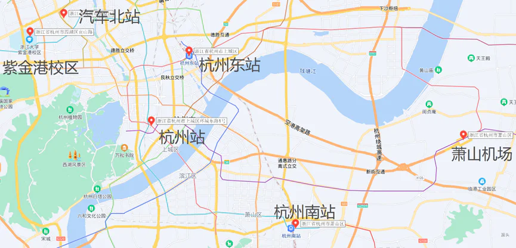

# 到校交通

## 杭州交通枢纽

### 萧山国际机场

杭州市目前唯一的民用机场，全国到杭州的所有飞机在此降落。距离紫金港校区搭乘地铁约1.2小时，花费9元；打车约1小时，花费约130元。

### 杭州东站

杭州市客流量最大的火车站，大部分G/D字头动车均在此停靠。距离紫金港校区搭乘公共交通约1小时，花费5元；打车约30~40分钟，花费约50元。

### 杭州西站

杭州市最近建成的火车站，主要服务浙江省内，乘坐19号线转5号线到紫金港校区南大门约半小时。

### 杭州站（城站）

杭州市老火车站，在杭州人的口头称呼和杭州地铁、公交的线路站名中都被称为“城站”，杭州站和杭州东站是杭州市最为繁忙的两个车站，大量动车与普速列车均在此站停靠。距离紫金港校区搭乘公共交通约1小时，花费5元；打车约30~40分钟，花费约50元。

### 杭州南站（萧山站）

近年新开通运营的火车站，由原萧山站改造而来，只有少数动车在此停靠，但是大部分经过杭州的普速列车均在杭州南站停靠。距离紫金港校区搭乘公共交通约1.5小时，花费7元；打车约40~50分钟，花费约110元。
在此提醒家庭所在地较远且交通预算较为紧张的同学们注意：从杭州南站前往江北主城区的公交和地铁最晚在22：30左右就已发出末班车，而在暑假和春运等高峰期时有大量加开的长途普速列车都是在公共交通末班车以后才到达杭州南站，深夜公交次数非常少且只能到达离紫金港仍有很远距离的公交武林广场站。所以如果你需要在深夜到达杭州南站，请一定提前做好过夜的相关准备。考虑到在杭州南站周围非常缺乏廉价的住宿选择，个人推荐可以在火车站的东候车厅过夜等待至第二天早晨地铁首班车开出。

### 汽车北站

距离紫金港校区最近的汽车站，省内学生可搭乘大巴车在此下车。距离紫金港校区打车约15分钟，花费约15元，不建议搭乘公共交通。
各交通枢纽地理位置见下图。

## 入校

乘坐火车和飞机前往杭州的同学，建议乘坐杭州地铁到2号线或5号线地铁三坝站F口出站，然后乘坐学校的大巴直接入校到宿舍楼下。在开学季以外的时间往返杭州时，推荐在地铁2号线的虾龙圩站下车，虾龙圩站的C出口处有前往紫金港校区方向的1210M路公交接驳车，可以直接到达紫金港校医院门口，在糟糕天气中携带大件行李时颇为省力。

接待时间：

8月17日7:30-18:00；8月18日7:30-18:00。

自行入校的学生从紫金港校区东门（申花路）或南一门（余杭塘路）入校。

## 家长入校预约

目前2024级紫金港校区新生信息已经录入门禁系统。但家长入校需要在浙大钉上进行预约。车辆入校问题请咨询辅导员。

在浙大钉或钉钉的“工作台”（下方浙大求是鹰标志）页面中，点击“全部”，可以看到访客预约功能的入口，进入后点击预约，填写相关信息后提交，对应手机号将会收到短信，此时可以在预约的时间使用身份证入校。

> 邀约功能和预约功能的区别是，邀约是把链接发给受邀人让ta填写相关信息，信息填写后需要邀请人在访客预约系统中审核。
